MicrogridUP Software Playbook:

PREPARED BY:

NRECA Research

A User Guide

March 2024

MicrogridUP Software Playbook:

**A User Guide**

Prepared by NRECA Research with funding from the Department of Defense’s
Environmental Security Technology Certification Program (ESTCP) under
award number EW20-B8-5055.

NRECA Research Project Team

**Lauren Khair**

Co-PI, MicrogridUP  
Senior Director of Energy Research & Resilience  
<Lauren.Khair@nreca.coop>

**David Pinney**  
Co-PI, MicrogridUP

Principal Analytical Tools & Software Products

David.Pinney@nreca.coop

Copyright © 2024 by the National Rural Electric Cooperative Association.
All Rights Reserved.

> **Legal Notice**
>
> This work contains findings that are general in nature. Readers are
> reminded to perform due diligence in applying these findings to their
> specific needs, as it is not possible for NRECA to have sufficient
> understanding of any specific situation to ensure applicability of the
> findings in all cases. The information in this work is not a
> recommendation, model, or standard for all electric cooperatives.
> Electric cooperatives are: (1) independent entities; (2) governed by
> independent boards of directors; and (3) affected by different member,
> financial, legal, political, policy, operational, and other
> considerations. For these reasons, electric cooperatives make
> independent decisions and investments based upon their individual
> needs, desires, and constraints. Neither the authors nor NRECA assume
> liability for how readers may use, interpret, or apply the
> information, analysis, templates, and guidance herein or with respect
> to the use of, or damages resulting from the use of, any information,
> apparatus, method, or process contained herein. In addition, the
> authors and NRECA make no warranty or representation that the use of
> these contents does not infringe on privately held rights. This work
> product constitutes the intellectual property of NRECA and its
> suppliers, and as such, it must be used in accordance with the NRECA
> copyright policy.

**Acknowledgements**

NRECA Research and the MicrogridUP team thank the following individuals
and organizations for their contributions to the MicrogridUP software
development and Playbook:

- Brunswick EMC (Georgia)

- NCEMC (North Carolina)

- Cobb EMC (Georgia)

- Rio Grande Electric Cooperative (Texas)

- Choctawhatchee Electric Cooperative, Inc. (CHELCO) (Florida)

- Sussex Rural Electric Cooperative (New Jersey)

- Fort Bliss (U.S. Army) (Texas), Department of Public Works

- Laughlin Air Force Base (Texas), Energy Office

- Eglin Air Force Base (Florida), Energy Office

- Picatinny Arsenal (U.S. Army) (New Jersey), Department of Public Works

- Chris Nichols, Renewables Forward

- Chris Wilkins and Laura Moorefield, Moorefield Research & Consulting,
  LLC

# Table of Contents

[Overview [4](#overview)](#overview)

[Prerequisites [6](#prerequisites)](#prerequisites)

[Docker Requirements [6](#docker-requirements)](#docker-requirements)

[MicrogridUP Hardware and Software Requirements
[6](#microgridup-hardware-and-software-requirements)](#microgridup-hardware-and-software-requirements)

[MicrogridUP Input Data Requirements
[7](#microgridup-input-data-requirements)](#microgridup-input-data-requirements)

[Installation [8](#installation)](#installation)

[Using MicrogridUP [10](#using-microgridup)](#using-microgridup)

[General Guidance/Tips
[10](#general-guidancetips)](#general-guidancetips)

[Working with Projects
[10](#working-with-projects)](#working-with-projects)

[Creating a New Project
[11](#creating-a-new-project)](#creating-a-new-project)

[Outputs [16](#outputs)](#outputs)

[Overview [16](#overview-1)](#overview-1)

[Map [17](#map)](#map)

[Interconnection [18](#interconnection)](#interconnection)

[Control [19](#control)](#control)

[Microgrids [20](#microgrids)](#microgrids)

[Files [21](#files)](#files)

[Inputs [21](#inputs)](#inputs)

[Appendix A: Descriptions of Input Data Requirements
[22](#appendix-a-descriptions-of-input-data-requirements)](#appendix-a-descriptions-of-input-data-requirements)

[User Goals [22](#user-goals)](#user-goals)

[Circuit File [22](#circuit-file)](#circuit-file)

[Existing Distributed Generation
[22](#existing-distributed-generation)](#existing-distributed-generation)

[Distribution System Equipment Specifications
[22](#distribution-system-equipment-specifications)](#distribution-system-equipment-specifications)

[Critical Loads [23](#_Toc160729943)](#_Toc160729943)

[Metering Data [23](#metering-data)](#metering-data)

[Full Rate Schedule [23](#full-rate-schedule)](#full-rate-schedule)

[Outage Statistics [23](#outage-statistics)](#outage-statistics)

[Weather Data [24](#weather-data)](#weather-data)

[Resilience Metrics and Microgrid Siting
[24](#resilience-metrics-and-microgrid-siting)](#resilience-metrics-and-microgrid-siting)

[Microgrid Specifications
[24](#microgrid-specifications)](#microgrid-specifications)

[Appendix B: Technology-Specific Considerations for MicrogridUP Modeling
[33](#appendix-b-technology-specific-considerations-for-microgridup-modeling)](#appendix-b-technology-specific-considerations-for-microgridup-modeling)

[Diesel and Natural Gas Generators (Reciprocating Internal Combustion
Engines (RICE))
[33](#diesel-and-natural-gas-generators-reciprocating-internal-combustion-engines-rice)](#diesel-and-natural-gas-generators-reciprocating-internal-combustion-engines-rice)

[Combined Heat & Power (CHP)
[34](#combined-heat-power-chp)](#combined-heat-power-chp)

[Other Generators [34](#other-generators)](#other-generators)

[PV Systems [34](#pv-systems)](#pv-systems)

[Wind Generators [37](#wind-generators)](#wind-generators)

[Energy Storage Systems (ESS)
[38](#energy-storage-systems-ess)](#energy-storage-systems-ess)

[Codes and Standards [40](#codes-and-standards)](#codes-and-standards)

# Overview

The MicrogridUP software is a microgrid planning tool that enables
military installations and utility privatization (UP) system owners to
quickly and accurately determine microgrid investment options to improve
installation resilience. The MicrogridUP Playbook is a step-by-step
software user manual to guide U.S. military energy managers, military
advisors and contractors, and utilities through the microgrid design
process using the MicrogridUP software.

From 2021-2024, NRECA Research developed the MicrogridUP software,
leveraging previously funded Department of Energy (DOE) and national
laboratory projects. MicrogridUP supports military installation energy
resilience, defined by the U.S. Department of Defense (DoD) as “the
ability to prepare for and recover from energy disruptions that affect
mission assurance on military installations.”[^1] With decreasing costs
for renewable generation and energy storage, military planners are
exploring microgrids as a resilient and increasingly cost-effective
energy management solution to ensure continuity of critical loads.

**What is a Microgrid?**

A microgrid, as defined by the U.S. DOE, is: “a group of interconnected
loads and distributed energy resources that acts as a single
controllable entity with respect to the grid. It can connect and
disconnect from the grid to operate in grid-connected or island mode.”

While other microgrid planning tools are available, they may lack the
robust elements needed to fully anticipate hardware, software, and
budgeting needs for the complex microgrid configurations needed to
provide continuity of operations for large and/or critical military
loads. The MicrogridUP tool fills this gap by enabling planners to enter
the complete set of data needed to design microgrids and networks of
microgrids for multibuilding sites at military installations, including:

- Resilience requirements (e.g., 14-day resilience requirement for U.S.
  Army installations)

- Load characterization

- Existing energy sources

- Gas and electric rates

<!-- -->

- All relevant installation circuits—low voltage (building), medium
  voltage (distribution), and high voltage (transmission)

This software uses standard assumptions and data requirements to the
extent possible, while allowing maximum design flexibility. Based on
user inputs and locational data, MicrogridUP solves the key
computational problems in large installation microgrid design—optimal
distribution design and generation mix. Prior to release, the tool was
field-validated at four diverse military installations.

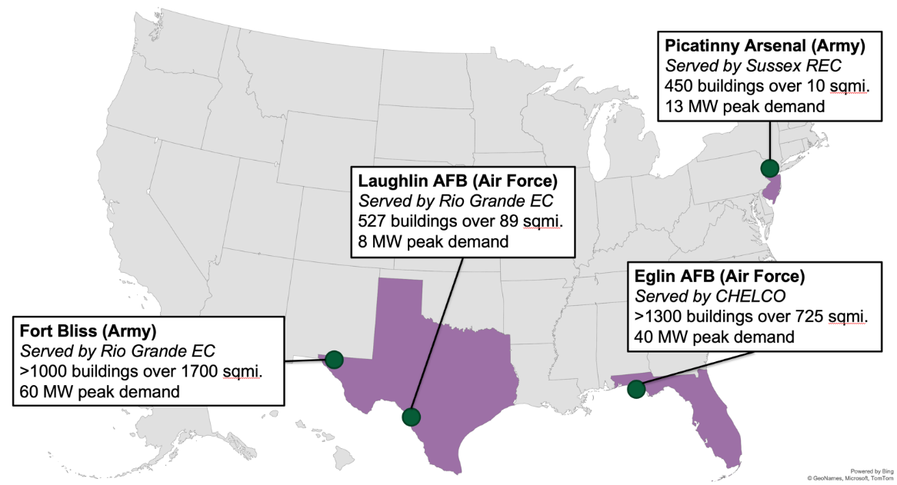

Key goals of the MicrogridUP tool are:

- Increasing resilience—100% of critical load is supported through a
  proposed microgrid design solution, including microgrids or networks
  of microgrids to serve a single critical load (e.g., server control
  room, a single building (e.g., hospital), a group of buildings (e.g.,
  military headquarters or remote artillery range), an entire campus or
  military base, or a city block or neighborhood.

- Reducing labor requirements and soft costs to design an appropriate
  microgrid—Optimization using MicrogridUP modeling results in a 30%
  (approximate) reduction in labor hours for design tasks, related
  engineering, and other soft costs compared to existing methods.

- Producing accurate cost estimates for the lifecycle of microgrid
  solution(s)—Realistic cost expectations developed to enable user to
  implement the proposed microgrid solution at the military
  installation.

MicrogridUP is a technical software designed for use by distribution
engineers and other microgrid planners with similar expertise. Although
tailored to a military use case, MicrogridUP can also be used by energy
services companies and utilities for large industrial or commercial use
cases.

The software is a web application installed by the user on a local
system using Docker (details provided in [Docker
Requirements](#docker-requirements) section). All files stay on the
local system; no information is shared beyond the system on which it is
installed. For information on microgrid cybersecurity, see the 2020
Sandia National Laboratories Report entitled [*Cybersecurity of
Networked Microgrids: Challenges, Potential Solutions, and Future
Directions*](https://www.sandia.gov/research/publications/details/cybersecurity-of-networked-microgrids-challenges-potential-solutions-and-fu-2020-12-22/).

# Prerequisites

## Docker Requirements

MicrogridUP is a web application that is installed on a local system
using Docker, a software platform designed to run containerized
applications. This means that MicrogridUP can run on any Mac, Windows,
or Linux system that supports Docker. You must install Docker Desktop
software before you can install and run MicrogridUP.

For Docker Desktop system requirements, see the appropriate link below
for your operating system:

- **Mac**: <https://docs.docker.com/desktop/install/mac-install/>

- **Windows**:
  <https://docs.docker.com/desktop/install/windows-install/>

- **Linux**: <https://docs.docker.com/desktop/install/linux-install/>

## MicrogridUP Hardware and Software Requirements

As mentioned above, MicrogridUP can run on any Mac, Windows, or Linux
system that supports Docker Desktop software. See the links above in
[Docker Requirements](#docker-requirements) for supported platforms.

**Note:** Because MicrogridUP is a containerized web application, all
files and data used in the analysis stay on the local system. No
information is shared beyond the system on which MicrogridUP is
installed.

## MicrogridUP Input Data Requirements

The quality of the outputs that MicrogridUP generates is directly
related to the quality of the input data it receives. The table below
specifies ideal and minimum required input data.

With the **Ideal** level of data in the table below, MicrogridUP can
return results for every load in the system. The **Minimum Required**
level of data allows for circuit-level modeling of potential microgrids.

If additional sources of data become available during the evaluation
process, they can be incorporated later.

Most fields in the MicrogridUP software include default values, which
are listed and described in [Microgrid
Specifications](#microgrid-specifications) in Appendix A. The software
will output more accurate projects and estimates if you provide actual
data for each **Data Type** below.

<table>
<caption>
Figure 1. Four test installations and the utilities that
serve them through UP contracts.
</caption>
<colgroup>
<col style="width: 16%" />
<col style="width: 29%" />
<col style="width: 36%" />
<col style="width: 17%" />
</colgroup>
<thead>
<tr class="header">
<th>Data Type</th>
<th>Ideal</th>
<th>Minimum Required</th>
<th>Supported 
File Formats</th>
</tr>
</thead>
<tbody>
<tr class="odd">
<td>Meter Data 
for Base</td>
<td>One year of 15-minute AMI data</td>
<td>One year of monthly energy consumption per building and SCADA load
profiles for individual feeders</td>
<td>.csv</td>
</tr>
<tr class="even">
<td>Circuit</td>
<td>Windmil/ 
Cymedist model</td>
<td>Substation and feeder data to manually construct a circuit
model</td>
<td>.dss</td>
</tr>
<tr class="odd">
<td>GIS</td>
<td>Shapefile</td>
<td>GIS coordinates for loads</td>
<td>.kml, .shp, etc.</td>
</tr>
<tr class="even">
<td>Cost of Power</td>
<td>Full rate schedule</td>
<td>Energy (kWh) and demand (kW) charges</td>
<td>.csv</td>
</tr>
<tr class="odd">
<td>Resilience Requirements</td>
<td>Specific resilience targets in numbers like SAIDI</td>
<td>Critical loads identified</td>
<td>.csv</td>
</tr>
<tr class="even">
<td>Outage Statistics</td>
<td>Data from all historical outages, including locations and
equipment</td>
<td>No outage data</td>
<td>.csv</td>
</tr>
</tbody>
</table>

Figure 1. Four test installations and the utilities that serve them
through UP contracts.

For additional descriptions of input data requirements and uses, see
[Appendix A: Descriptions of Input Data
Requirements](#appendix-a-descriptions-of-input-data-requirements).

# Installation

MicrogridUP is a web application using Docker, a software platform
designed to run containerized applications. To use MicrogridUP, you must
first install the Docker Desktop software. Then you will download and
install the MicrogridUP app.

**To install MicrogridUP:**

1.  Install Docker Desktop using the instructions at the appropriate
    link below:

> **Mac**: <https://docs.docker.com/desktop/install/mac-install/>
>
> **Windows**:
> <https://docs.docker.com/desktop/install/windows-install/>
>
> **Linux**: <https://docs.docker.com/desktop/install/linux-install/>
>
> **Note:** MicrogridUP is a Linux container, not a Windows container.

2.  Open a command prompt and enter this command to download the
    MicrogridUP app:

> docker pull ghcr.io/dpinney/microgridup:main

3.  To start MicrogridUP, run this command:

> docker run -d -p 5001:5000 --name mgucont
> ghcr.io/dpinney/microgridup:main

4.  Once the command completes, open a web browser and navigate to
    <http://127.0.0.1:5001>.

    The MicrogridUP app should open to the Home screen below.

    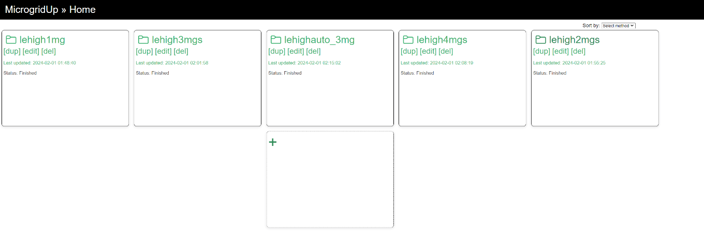

> For next steps, see [Using MicrogridUP](#using-microgridup).

5.  To stop using the MicrogridUP app:

    1.  Run docker stop mgucont at a command prompt.

    2.  Close Docker Desktop.

6.  To start the app again:

    1.  Open Docker Desktop.

    2.  Run docker start mgucont at a command prompt.

    3.  Open a web browser and navigate to <http://127.0.0.1:5001>.

To upgrade, repeat steps 2-4 above. To retain your project data, migrate
the folder /data/projects/ from the original container to the new one
before deleting the old container.

# Using MicrogridUP

## General Guidance/Tips

MicrogridUP is a robust optimization model that incorporates a wide
range of input data. Due to the complexity of the underlying
calculations, **expect long processing times—**from 30 minutes for
simple queries to six hours or longer for more complex scenarios.

In addition, **optimization models like** **MicrogridUP can fail** for
many reasons, for example if a proposed scenario is not feasible or
requires too long to process.

To mitigate these issues, we suggest the following approaches to using
MicrogridUP:

- Start small and build up. When creating a complex project, it may be
  helpful to first run MicrogridUP with a smaller subset of data. Then
  gradually increase the complexity by adding additional critical loads,
  circuits, etc. in later projects.

- Run complex scenarios overnight.

## Working with Projects

When opening MicrogridUP, you should see the Home screen below.

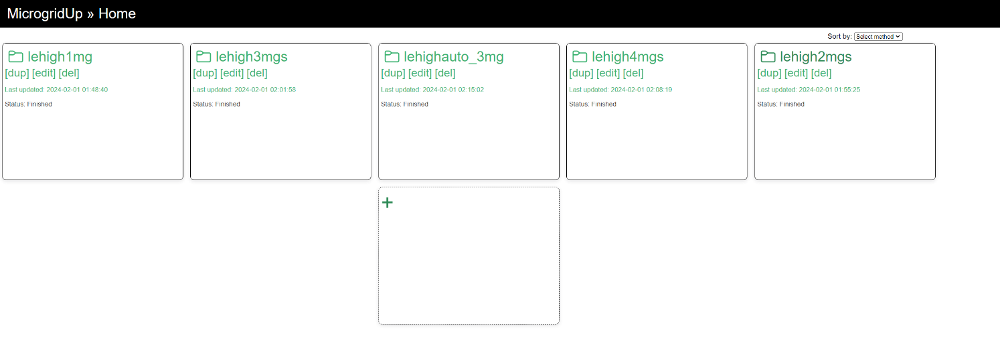

Each box on this screen represents a completed project. A **project**
consists of a set of input data and the microgrid design created by
MicrogridUP based on that data. MicrogridUP includes five example
projects (lehigh 1-5) to demonstrate the functionality of the software.
You can create a different project for each installation, or create
multiple projects for the same installation to test different sets of
assumptions or inputs.

From the Home screen you can:

- Create a new project. See [Creating a New
  Project](#creating-a-new-project).

- View the output of an existing project by clicking its title. See
  [Outputs](#outputs) for more information.

- Duplicate, edit, or delete an existing project.

## Creating a New Project

### Step 1: Input project information

1.  From the MicrogridUP Home screen, click the empty square with the +
    character. The MicrogridUP \> New screen opens.

> Many of the fields in a new project have default values, but these can
> be changed.

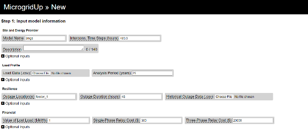

2.  Enter a **Project Name**. This name will be used to identify this
    project on the Home screen.

3.  Complete the rest of the fields in the Step 1 section.

    **Note:** The **Load Data** file must be a CSV file with one load
    per column. The top row must contain the load name, and the next
    8,760 rows contain hourly load data in kW. Each load described in
    the circuit definition (.dss) file in the next step must have a
    corresponding column in the Load Data file and the names must match
    exactly.

> **Tip**: Hover over a field label for more information about that
> field. For detailed information, see Table 1 in the [Microgrid
> Specifications](#microgrid-specifications) section of Appendix A.

### Step 2: Specify existing circuit

In this step, you will characterize the distribution system and
designate any critical loads.

MicrogridUP uses OpenDSS to model the distribution system so a .dss file
is required. This file can have varying levels of detail, depending on
the type of analysis to be done. The most basic level shows the
substation and feeders, along with transformers, regulators, switches
and loads. A more detailed model might include individual
buildings/loads and downstream distribution system elements. Any
distributed energy resources (solar, prime generators, combined heat and
power (CHP) generators, energy storage systems) to be used in the
microgrid also need to be included in the .dss file.

To add a circuit file to MicrogridUP, you can either upload an existing
.dss file or generate a file by manually specifying the elements and
values in the circuit. To gain familiarity with the software, we
recommend manually building a simplified circuit file with a single
substation and feeder.

**Note**: Whether a .dss file is imported or manually generated, each
load described in the file must have a corresponding column in the Load
Data file (from [Step 1: Input project
information](#step-1-input-project-information)) and the names must
match exactly.

**To upload a circuit file:**

1.  Under Step 2, click **Upload circuit from file**.

2.  Click **Choose File**, then browse to the .dss file location and
    select it.

    When selecting a .dss file, consider the following:

- Make sure any Windmil/Cymdist model used to generate the file is
  complete and without errors or the translation will fail.

- gen_bus in the .dss file must have loads directly attached, otherwise
  the bus will not have a KV rating in the .dss tree structure and
  consequently MicrogridUP will fail to run.

- If existing distributed generation is included, you must specify
  whether the load values include the distributed generation, or whether
  it is accounted separately.

3.  Click **Upload**.

4.  After successfully uploading the circuit file, select all critical
    loads from the list below the Circuit Definition dialog. **Critical
    loads** are loads which must be powered during outages or other
    resiliency events.

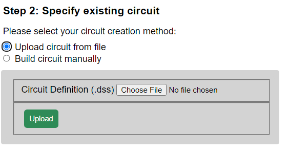

**To Build a Circuit Manually:**

1.  Under Step 2, click **Build circuit manually**.

2.  In the Circuit Builder, specify a **Latitude** and **Longitude**.
    These will be used to calculate the available wind and solar
    resources. Please choose a lat/long pair inside the boundaries of
    the circuit being modeled, such as the location of the substation.

3.  When the Circuit Builder opens, it is populated with sample
    elements. You can edit or delete these, or add additional elements.

    1.  To create an element, click **Add Element**. Complete the fields
        to describe the element, then click **Add Element** again.

    2.  To edit an existing element, give it a new name or change its
        other values.

    3.  To delete an element, click the red Trash icon next to it.

4.  When you have finished configuring the circuit, click **Submit
    circuit**.

5.  After successfully submitting the circuit, select all critical loads
    from the list below the Circuit Builder dialog. **Critical loads**
    are loads which must be powered during outages or other resiliency
    events.

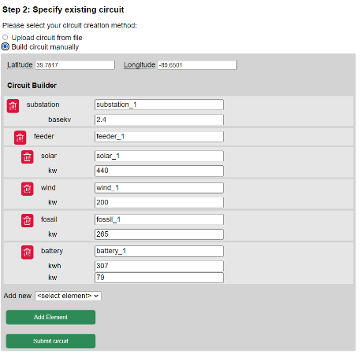

### Step 3: Partition circuit into microgrids

In this step, you can explore different methods for partitioning your
circuit into microgrids and choose one that best fits your environment.

1.  Under Step 3, select a **Microgrid Definition Method**.

    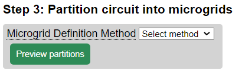

    For more information about each of these methods, see the tooltips
    beside each method.

    **Note**: Increasing the number of microgrids in the project
    increases processing time.

2.  Click **Preview partitions** to see the number and locations of the
    microgrids that will be modeled using the specified method.

### Step 4: Select technologies to be used in microgrids

### 

Next select the types of energy and/or storage technologies to be used.

1.  Under Step 4, select one or more technologies.

    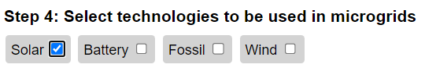

> As you select each box, additional fields for that option are
> displayed with default values. For detailed information, see Table 2
> in the [Microgrid Specifications](#microgrid-specifications) section
> of Appendix A.

2.  If necessary, change the default values for each technology.

### 

### Step 5 (Optional): Override technology parameters per-microgrid

By default, the values specified in Step 4 (for example, available fuel)
are applied globally to all microgrids. In this step, you can override
these global values for some parameters and assign different values to
different microgrids if desired.

For example, if you want to restrict generation options in a given
location (e.g., no wind near flight facilities but allowed at other
locations) that can be done in this input.

1.  Under Step 5, select the microgrid you want to modify.

2.  To modify the value for a parameter:

    1.  Click the green + icon.

    2.  Select the parameter you want to modify from the list.

    3.  Enter the new value for the parameter.

> **Tip**: For parameter descriptions, hover over a field label in Step
> 4.

3.  Repeat these steps for each parameter on each microgrid you want to
    override.

    You can override values for all of the available parameters on
    **each** microgrid. If you don’t specify a value here, the microgrid
    will continue to use the default value for that parameter specified
    in Step 4.

4.  After entering values for all desired parameters, click **Run
    project** to start processing.

    MicrogridUP will display a status screen with the progress of the
    modeling process. This screen will refresh automatically to show the
    most recent data. Once the run is complete (which may take 30
    minutes to several hours), the results will be displayed
    automatically. For more information on these results, see
    [Outputs](#outputs).

# Outputs

MicrogridUP produces the following outputs for each modeled microgrid
project: overview of the economics and resilience of the design;
one-line and GIS displays of the proposed microgrid solution; results of
the interconnection and control simulations; and detailed design
results. Each output is on a separate tab—Overview, Map,
Interconnection, Control, Microgrids, Files, and Inputs—and most output
tabs include graphs or images. Where relevant, tabular outputs are also
included for easy export to other tools such as Microsoft Excel.

## Overview

The Overview tab provides results of the full design with the following
outputs:

- Financial Summary—summary of capital expenditures for microgrid(s) and
  the net present value (NPV). Positive net present values show that
  demand and energy services provided by the microgrids pay back more
  than the original capital investment.

- Microgrid Load and Generation—breakdown of existing generation and
  loads.

- Microgrid Generation Mix, Existing and New—suggested new generation
  additions and how this compares to the load that needs to be served

- User Warnings—warnings about assumptions made within MicrogridUP (such
  as decommissioning of storage, which can’t be integrated due to power
  limitations).

- Distribution Upgrades needed to create Microgrids—detailed list of all
  distribution upgrades that will be necessary to host the microgrids.

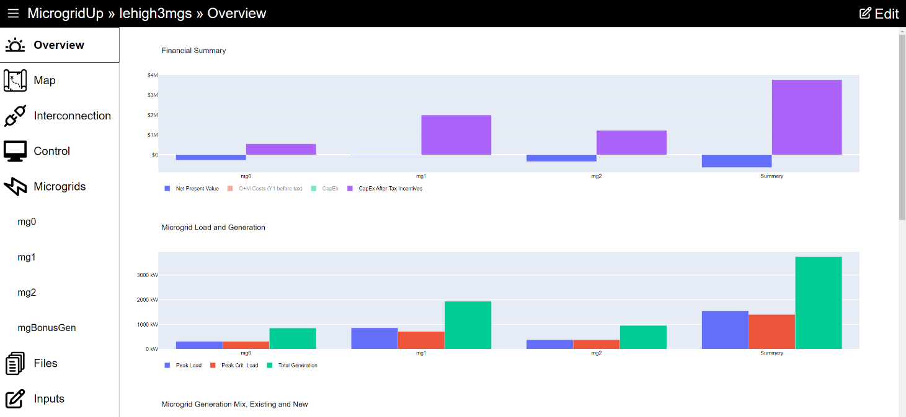

## Map

The Map tab includes a GIS map of modeled microgrid or network of
microgrids, with different colors indicating distinct microgrids. This
image illustrates how the buildings and circuit align and displays the
circuit and microgrid boundaries along with geospatial map tiles. You
can inspect each of the generation resources added to the circuit model
and their detailed specifications. Should you need to manually adjust
the circuit, the overlaid one-line interface allows full editing
support.

## Interconnection

The Interconnection tab displays quasi-static load-flow simulation
results for the project under normal (no fault) operations along with a
hosting capacity analysis for each microgrid. The Interconnection tab
includes graphics depicting:

- Generator Output—maximum kW of new uncontrolled generation (i.e.,
  renewables) that can be interconnected.

- Load Voltage—maximum voltage of critical loads.

- Voltage Source Output—confirmation that the timeseries voltages under
  normal operating conditions are within the ANSI band.

- Tap Position—tap setting on voltage regulators on the circuit. This
  can be used to verify new generation does not lead to excessive tap
  changer operation.

- Traditional Hosting Capacity By Bus—total kW capable of
  interconnection at each bus on the circuit.

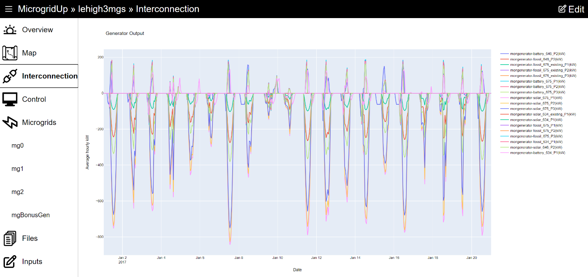

## 

## Control

The Control tab provides detailed results of how the microgrid(s) will
perform during the user-specified critical outage, e.g., a 7-day loss of
power from the bulk power system during the time of highest load and
lowest renewable output. The Control tab includes graphics depicting:

- Generator Output—maximum output required of generators.

- Load Voltage—maximum voltage of critical loads.

<!-- -->

- Tap Position—tap setting on voltage regulators on the circuit. This
  can be used to verify new generation does not lead to excessive tap
  changer operation.

<!-- -->

- Battery Cycles During Analysis Period—number of battery cycles during
  the critical outage.

- Fossil Genset Loading Percentage—fossil generator loading during the
  critical outage.

  - Note: If battery cycles or generator loading exceed the limits of
    the hardware during a critical outage, MicrogridUP modifies the
    generator design to modify expected battery lifetime or increase
    minimum generator size.

- Diesel and Natural Gas Equivalent Consumption During Outage by
  Microgrid—fuel requirements for the fossil generators on the
  microgrids. This is used to calculate the amount of fuel storage
  needed, which impacts price as well as land required to develop the
  microgrid.

- Inrush Current Report— predicted inrush current required to black
  start each microgrid. In the case of a renewable-only microgrid,
  inrush cannot be supplied by generators or economically via storage,
  so MicrogridUP calculates a capacitor bank size and adds it to the
  total cost of the microgrid. Inrush calculations use circuit
  information from the user inputs.

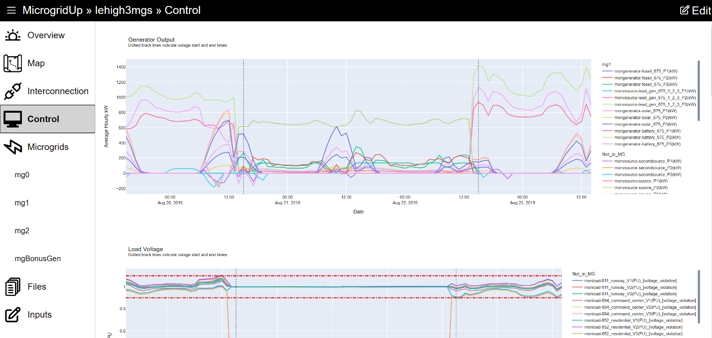

## Microgrids

The Microgrids tab includes detailed annual results for the generation
additions and annual energy consumption and generation. Because outages
are infrequent and outage costs are difficult or impossible to
calculate, the economics of normal operation will dominate those of
operation during an outage. The Microgrids tab includes outputs for each
individual microgrid in the system, with graphics depicting:

- Lifetime Financial Comparison Overview

- Generation Overview

- Generation Serving Load

- Solar Generation Detail

- Wind Generation Detail

- Fossil Generation Detail

- Storage Charge Source

- Storage State of Charge

- Resilience Overview – Longest Outage Survived

- Outage Survival Probability

- Input Data

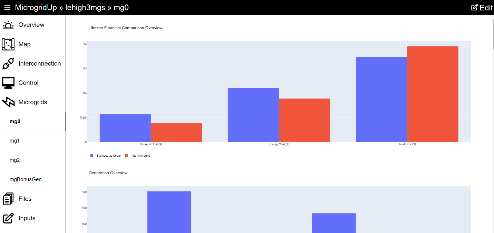

## Files

The Files tab includes a list of files used and generated the
MicrogridUP analysis.

## Inputs

The Inputs tab displays all input values provided by the MicrogridUP
user.

# Appendix A: Descriptions of Input Data Requirements

Appendix A provides additional information on MicrogridUP’s input data
requirements, default values (where relevant), definitions, and usage or
purpose of different data inputs. MicrogridUP includes techno-economic
analyses from the National Renewable Energy Laboratory’s Renewable
Energy Optimization Tool (REopt®), available from:
<https://reopt.nrel.gov/>. Because of this overlap, we provide links to
the REopt Web Tool User Manual for additional information on certain
inputs.

## User Goals 

- Description: Resilience and operational goals for the target
  facilities. Includes providing for both long-term outages and
  shorter-term disruptions. Includes specific requirements/restrictions
  for distributed generation options (especially renewable generation
  goals and net-metering status). Should be coordinated with the base
  utility and water plan.

- Use: Design of the microgrid options depends on the user’s resilience
  requirements as well as restrictions on the use of new fossil and
  renewable generation.

- Source: Customer

## Circuit File

- Description: Full Windmil/Cymdist data model (including GIS data
  showing physical locations of buildings and other assets).

- Use: MicrogridUP does an economic analysis which includes selected
  existing generation equipment, then runs a power-flow model using full
  circuit data.

- Source: Owner of distribution system

## Existing Distributed Generation

- Description: Optional list of existing distributed generation, both
  renewable and fossil-based (e.g., combined heat and power (CHP),
  solar, wind, and energy storage.) Renewable generation should include
  type and capacity (both DC and AC if applicable). Fossil generation
  should include type, fuel source, fuel storage capacity, and age. This
  category also includes existing backup generation that could be used
  in microgrid operations.

- Use: MicrogridUP does an economics analysis which includes existing
  distributed generation sources that could be used with the microgrid.

- Source: Customer

## Distribution System Equipment Specifications

- Description: Technical specifications of equipment in existing
  distribution system which might need to be used in the microgrid,
  including any existing capabilities for providing distribution system
  and building-level load management. Equipment includes applicable
  switches, relays, and load control options for feeders, line sections,
  building, or sub-building loads.

- Use: Required for power-flow analysis, especially to identify
  equipment which may need to be upgraded/replaced for a microgrid
  project.

- Source: Customer, owner of distribution system (likely multiple
  documents)

## Critical Loads

**Is your military base able to sub-meter individual buildings and
loads?**

Sub-metering allows the installation to control which buildings or
portions of a circuit may be “islanded," or included inside the
microgrid.

**What:** Loads that must be supported during an external outage.

**Need:** Defined size, duration, location, to be able to design an
optimal microgrid.

- Description: Prioritized list of critical loads, defined as loads that
  must be powered during resiliency events. These loads must be
  identified with facilities on the circuit model.

- Use: Critical loads are used to determine the most cost-effective
  solutions. Prioritized lists are used to implement “Fast Load
  Shedding” control schemes, if necessary.

- Source: Customer

## Metering Data

- Description: At least one year of historical load data for both
  electricity and gas consumption.

- Use: Historical load data is used to simulate system performance in
  both the economic optimization and power-flow modeling parts of
  MicrogridUP. One year of detailed data is needed both to show load
  profiles (time of use over a single day) and seasonal variations in
  total energy requirements.

- Source: Customer and customer utilities

## Full Rate Schedule

- Description: Details of the electric utility rate structure, include
  rate name, fixed charges, energy charges (kWh), and demand charges
  (kW). Details should include time-of-use energy rates, seasonal
  variation in energy and demand, coincident/non-coincident demand
  charges if applicable, net metering or distributed generation “buy-in”
  options, and gas supply contract.

- Use: MicrogridUP uses these rates to estimate and optimize operating
  costs for future microgrids including savings from renewable
  generation. The data is also used to estimate the value of ancillary
  services such as net-metered energy and peak shaving.

- Source: Customer and customer utilities

## Outage Statistics

- Description: Data from all historical outages, including locations and
  equipment (optional)

- Use: This information is needed to define goals for the microgrid and
  to evaluate the ability of the microgrid to manage resilience events
  of differing durations.

- Source: Customer

## Weather Data

- Description: MicrogridUP accesses weather data, especially solar
  insolation and wind resource, through the REOpt performance software;
  there is no need to supply it separately.

- Use: This data is used to calculate performance of existing and
  proposed renewable generation.

- Source: MicrogridUP

## Resilience Metrics and Microgrid Siting 

- Description: A core input to MicrogridUP is the minimum survival time
  for critical loads (e.g., 336 hours in the case of Army resilience
  goals) which is called the Critical Outage. Each load in the project
  is classified as critical or non-critical. During outage simulations,
  MicrogridUP commands the microgrid to shed the non-critical loads. The
  result is a set of microgrids sized precisely for the critical loads,
  minimizing capital cost. Our military partners have validated that
  this is the most important resilience metric overall for mission
  success and continuity.

- Use: MicrogridUP also calculates average outage survival time for a
  given microgrid solution considering outages of all possible lengths
  and starting hours. This often exceeds the critical survival time,
  which is an ancillary benefit of microgrid deployments.

- Source: Customer

## Microgrid Specifications

The microgrid is specified in two steps. First, it is segmented by
specifying a “FAULTED_LINE” variable to be a switch that can disconnect
a subset of the distribution system circuit from all voltage sources.
Second, any loads that are “downstream” of the microgrid isolation
switch and included in the critical load file are added to the microgrid
specification, which is in turn added to the .dss model file.

The user interface allows the user to specify design options for each
microgrid, as well as economic conditions used in the financial
analysis. Table 1 shows the software’s default values and descriptions
in Step 1 of the interface. Table 2 shows the default values and
descriptions for Step 4.

<table>
<caption>
Figure 1. Screenshot of sample graphs from Overview
tab
</caption>
<colgroup>
<col style="width: 35%" />
<col style="width: 18%" />
<col style="width: 46%" />
</colgroup>
<thead>
<tr class="header">
<th><strong>Field Name</strong></th>
<th><strong>Default Value</strong></th>
<th><strong>Description</strong></th>
</tr>
</thead>
<tbody>
<tr class="odd">
<td><strong>Project Name</strong></td>
<td>(blank)</td>
<td>Project names must be entirely lowercase.</td>
</tr>
<tr class="even">
<td><strong>Interconn. Time Steps (hours)</strong></td>
<td>480.0</td>
<td>
Defines the length of the interconnection analysis.

Example – if time steps are 15 minutes, 480 would define a five-day
analysis.
</td>
</tr>
<tr class="odd">
<td><strong>Description</strong></td>
<td>(blank)</td>
<td>Include an optional description of the project. Max 140
characters.</td>
</tr>
<tr class="even">
<td><strong>Energy Cost ($/kWh)</strong></td>
<td>0.12</td>
<td>Energy charge per kWh.</td>
</tr>
<tr class="odd">
<td><strong>Wholesale Cost ($/kWh)</strong></td>
<td>0.034</td>
<td>To turn off energy export/net-metering set wholesale Cost to 0 and
excess PV gen will be curtailed.</td>
</tr>
<tr class="even">
<td><strong>Demand Cost ($/kW)</strong></td>
<td>20</td>
<td>Demand rate per kW.</td>
</tr>
<tr class="odd">
<td><strong>DG Can Curtail</strong></td>
<td>Yes</td>
<td>Allows for excess distributed generation to be automatically
curtailed.</td>
</tr>
<tr class="even">
<td><strong>DG Can Export</strong></td>
<td>Yes</td>
<td>Allows for excess distributed generation to be sold back to the
grid.</td>
</tr>
<tr class="odd">
<td><strong>Use URDB Rate?</strong></td>
<td>No</td>
<td>The electricity rate can be selected from a list of rates available
in the location entered. The rates are downloaded from the <a
href="http://en.openei.org/wiki/Utility_Rate_Database"><u>Utility Rate
Database (URDB)</u></a>. If available, the most common rates are listed
at the top of the list. Due to data limitations in some parts of the
country, the full list of rates includes rates available within 25 miles
of the location specified. <strong>This value, or a custom annual,
monthly or detailed rate, is required.</strong> Utility rates that are
not in URDB can only be modeled as custom rates. For more information,
please see the <a
href="https://reopt.nrel.gov/tool/reopt-user-manual.pdf#page=5"><u>The
REopt Web Tool User Manual.</u></a></td>
</tr>
<tr class="even">
<td><strong>URDB Label</strong></td>
<td>5b75cfe95457a3454faf0aea</td>
<td>If you want to use a URDB rate that isn’t available in the dropdown
list for your selected location, you can enter a URDB label that
corresponds to an unlisted rate. This label can be found in the URL for
the URDB rate on the Open EI website. For example, the label for the
rate found at the URL <a
href="https://openei.org/apps/IURDB/rate/view/5e6134175457a3cf56019407"><u>https://openei.org/apps/IURDB/rate/view/5e6134175457a3cf56019407</u></a>would
be entered as just the label 5e6134175457a3cf56019407.</td>
</tr>
<tr class="odd">
<td><strong>Load Data (.csv)</strong></td>
<td>(none)</td>
<td>Please upload a .csv file representing the hourly load shape. See <a
href="https://github.com/dpinney/microgridup/blob/main/docs/input_formats.md">https://github.com/dpinney/microgridup/blob/main/docs/input_formats.md</a>
for formatting details.</td>
</tr>
<tr class="even">
<td><strong>Analysis Period (years)</strong></td>
<td>25</td>
<td>
The financial life of the project in years. Salvage value is not
considered. Units: years. <strong>This value is not
required.</strong> 

Note for energy storage: 25-year project life, with 10-year battery
life, replaced once. For more information, please see <a
href="https://reopt.nrel.gov/tool/reopt-user-manual.pdf#page=5"><u>The
REopt Web Tool User Manual.</u></a>
</td>
</tr>
<tr class="odd">
<td><strong>Year</strong></td>
<td>2017</td>
<td>Baseline year of data collection.</td>
</tr>
<tr class="even">
<td><strong>Outage Location(s)</strong></td>
<td>670671</td>
<td>Node number in distribution map where typical outage would take
place.</td>
</tr>
<tr class="odd">
<td><strong>Outage Duration (hours)</strong></td>
<td>48</td>
<td>The number of hours the electric outage lasts. The system will be
sized to minimize the lifecycle cost of energy, with the additional
requirement that it must also sustain the critical load during the
outage period specified.  
 
<strong>This input is required to complete the optimization for energy
resilience. The input must be a number between 0 and
8759.</strong>  
 
For more information, please see <a
href="https://reopt.nrel.gov/tool/reopt-user-manual.pdf#page=5"><u>The
REopt Web Tool User Manual.</u></a></td>
</tr>
<tr class="even">
<td><strong>Historical Outage Data (.csv)</strong></td>
<td>(none)</td>
<td>
Please upload a .csv file representing historical outages. See <a
href="https://github.com/dpinney/microgridup/blob/main/docs/input_formats.md">https://github.com/dpinney/microgridup/blob/main/docs/input_formats.md</a>

for formatting details.
</td>
</tr>
<tr class="odd">
<td><strong>Maximum REopt Run-time (seconds)</strong></td>
<td>240</td>
<td>Please enter a number 30-86400. A greater maximum REopt run-time
could result in more precise REopt results. A maximum REopt run-time
that is too short could result in an error.</td>
</tr>
<tr class="even">
<td><strong>Value of Lost Load ($/kWh)</strong></td>
<td>1</td>
<td>Specify the value of lost load during a power outage in $/kWh.</td>
</tr>
<tr class="odd">
<td><strong>Single-Phase Relay Cost ($)</strong></td>
<td>300</td>
<td>Specify the cost of a single-phase relay in $.</td>
</tr>
<tr class="even">
<td><strong>Three-Phase Relay Cost ($)</strong></td>
<td>20000</td>
<td>Specify the cost of a three-phase relay in $.</td>
</tr>
<tr class="odd">
<td><strong>O+M Escalation (% per year)</strong></td>
<td>0.025</td>
<td>Please enter a number 0-1 for the Annual nominal O&amp;M cost
escalation rate. Format 0.XXX</td>
</tr>
<tr class="even">
<td><strong>Discount Rate (% per year)</strong></td>
<td>0.083</td>
<td>
The rate at which the host discounts the future value of all
future costs and savings. Note this is an after tax discount rate if the
Host is a taxable entity. Units: decimal percent. <strong>This value is
not required.</strong> For more information, please see the <a
href="https://reopt.nrel.gov/tool/reopt-user-manual.pdf#page=5"><u>The
REopt Web Tool User Manual.</u></a>

Discount rate: a percent value that represents the cooperative’s
internal cost of capital. A cooperative’s cost of capital is a
combination of equity and debt, calculated on a weighted basis, also
known as Weighted Average Cost of Capital (WACC). The cost of capital
represents how much the value a dollar would change over time and in the
future, but calculated to equal the value of today’s dollar, or Net
Present Value (NPV). Projects that have higher savings in the early
years will have a higher NPV than projects with savings that occur at
the end of project, assuming they are of the same term in years.

When comparing multiple options, they should all have the same
discount rate so that their respective NPVs will be comparable.

If the discount rate is part of the negotiable contract, then
different discount rates can be used.

Higher discount rates will typically result in lower NPVs when
compared on an equal basis.

MicrogridUP uses discounting when calculating the optimum dispatch.
Changing your discount rate will sometimes change how much of a specific
resource the model will specify, though the amount might not vary very
much.
</td>
</tr>
</tbody>
</table>

Figure 1. Screenshot of sample graphs from Overview tab

<table>
<caption>
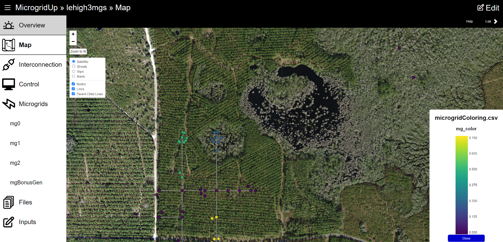
</caption>
<colgroup>
<col style="width: 35%" />
<col style="width: 18%" />
<col style="width: 46%" />
</colgroup>
<thead>
<tr class="header">
<th><strong>Field Name</strong></th>
<th><strong>Default Value</strong></th>
<th><strong>Description</strong></th>
</tr>
</thead>
<tbody>
<tr class="odd">
<td><strong>Solar Cost ($/kWh-DC)</strong></td>
<td>1600</td>
<td>Fully burdened cost of installed PV system in dollars per
kilowatt. <strong>This value is not required.</strong> For more
information, please see <a
href="https://reopt.nrel.gov/tool/reopt-user-manual.pdf#page=5"><u>The
REopt Web Tool User Manual.</u></a></td>
</tr>
<tr class="even">
<td><strong>Solar Power Max (kW-DC)</strong></td>
<td>1000000000</td>
<td>
REopt identifies the total system size that minimizes the
lifecycle cost of energy at the site. The maximum new PV size limits the
new PV system (not including any existing PV system) to no greater than
the specified maximum.

To remove the option of a new PV system from consideration in the
analysis, set the maximum size to 0. If a specific sized new generator
is desired, please enter that size as both the minimum size and also the
maximum size. This value is not required. For more information, please
see <a
href="https://reopt.nrel.gov/tool/reopt-user-manual.pdf#page=5"><u>The
REopt Web Tool User Manual.</u></a>
</td>
</tr>
<tr class="odd">
<td><strong>Solar Power Min (kW-DC)</strong></td>
<td>0</td>
<td>REopt identifies the total system size that minimizes the lifecycle
cost of energy at the site. The minimum new PV size forces a new PV
system of at least this size to appear at the site (in addition to any
existing PV system). If there is not enough land available, or if the
interconnection limit will not accommodate the system size, the problem
will be infeasible. The default value is 0 (no minimum size). If a
specific sized new generator is desired, please enter that size as both
the minimum size and also the maximum size. This value is not required.
For more information, please see <a
href="https://reopt.nrel.gov/tool/reopt-user-manual.pdf#page=5"><u>The
REopt Web Tool User Manual.</u></a></td>
</tr>
<tr class="even">
<td><strong>Solar MACRS Years</strong></td>
<td>5</td>
<td>MACRS schedule for financial analysis. Possible inputs are 0, 5 and
7 years. Set to zero to disable accelerated depreciation accounting for
solar.</td>
</tr>
<tr class="odd">
<td><strong>Solar ITC (% as decimal)</strong></td>
<td>0.26</td>
<td>Please enter a number 0-1 for the solar investment tax credit.
Format 0.XX</td>
</tr>
<tr class="even">
<td><strong>Battery Capacity Cost ($/kWh-AC)</strong></td>
<td>420</td>
<td>Energy capacity cost is the cost of the energy components of the
battery system (e.g., battery pack).  
 
The amount of energy that a battery can store is determined by its
capacity (kWh) while the rate at which it charges or discharges is
determined by its power rating (kW). While PV system cost is typically
estimated based on power rating (kW) alone, <strong>battery costs are
estimated based on both apacityy (kWh) and power (kW)</strong>.  
 
The power components of the system (e.g., inverter, balance of system
(BOS)) are captured by the power metric of $/kW and the energy
components of the system (e.g., battery) are captured by the energy
metric of $/kWh.  
 
This allows the capacity (kWh) and power (kW) rating of the battery to
be optimized individually for maximum economic performance based on the
load and rate tariff characteristics of the site. Some systems are
optimized to deliver high power capacity (kW), while others are
optimized for longer discharges through more energy capacity (kWh).</td>
</tr>
<tr class="odd">
<td><strong>Battery Capacity Max 
(kWh-AC)</strong></td>
<td>1000000</td>
<td>Specify the maximum desired battery capacity in kWh.</td>
</tr>
<tr class="even">
<td><strong>Battery Capacity Min 
(kWh-AC)</strong></td>
<td>0</td>
<td>Specify the minimum desired battery capacity in kWh.</td>
</tr>
<tr class="odd">
<td><strong>Battery Power Cost ($/kW-AC)</strong></td>
<td>840</td>
<td>Power capacity cost is the cost of the power components of the
battery system (e.g., inverter and balance of system (BOS)).  
 
The amount of energy that a battery can store is determined by its
capacity [kWh] while the rate at which it charges or discharges is
determined by its power rating [kW]. While PV system cost is typically
estimated based on power rating [kW] alone, <strong>storage costs are
estimated based on both capacity [kWh] and power [kW]</strong>.  
 
The power components of the system (e.g., inverter, BOS) are captured by
the power metric of $/kW and the energy components of the system (e.g.,
battery) are captured by the energy metric of $/kWh.  
 
This allows the capacity (kWh) and power (kW) rating of the battery to
be optimized individually for maximum economic performance based on the
load and rate tariff characteristics of the site. Some systems are
optimized to deliver high power capacity (kW), while others are
optimized for longer discharges through more energy capacity
(kWh).  
 
For example, assume the unit cost of power components is $1,000/kW, and
the unit cost of energy components is $500/kWh. Consider a battery with
5 kW of power capacity and 10 kWh of energy capacity (5 kW/10 kWh). The
total cost of the battery would be:  
 
(5 kW * $1,000/kW) + (10 kWh * $500/kWh) = $10,000.  
 
For more information, please see <a
href="https://reopt.nrel.gov/tool/reopt-user-manual.pdf#page=5"><u>The
REopt Web Tool User Manual.</u></a></td>
</tr>
<tr class="even">
<td><strong>Battery Power Max (kW-AC)</strong></td>
<td>1000000000</td>
<td>Specify the maximum desired battery power in kW.</td>
</tr>
<tr class="odd">
<td><strong>Battery Power Min (kW-AC)</strong></td>
<td>0</td>
<td>Specify the minimum desired battery power in kW.</td>
</tr>
<tr class="even">
<td><strong>Battery MACRS Years</strong></td>
<td>7</td>
<td>MACRS schedule for financial analysis. Possible inputs are 0, 5 and
7 years. Set to zero to disable accelerated depreciation accounting for
solar.</td>
</tr>
<tr class="odd">
<td><strong>Battery ITC (% as decimal)</strong></td>
<td>0</td>
<td>Please enter a number 0-1 for the battery investment tax credit.
Format 0.XX</td>
</tr>
<tr class="even">
<td><strong>Battery Replacement Power Cost ($/kW-AC)</strong></td>
<td>410</td>
<td>Power capacity replacement cost is the expected cost, in today’s
dollars, of replacing the power components of the battery system (e.g.
inverter, balance of systems) during the project lifecycle. <strong>This
value is not required.</strong> For more information, please see <a
href="https://reopt.nrel.gov/tool/reopt-user-manual.pdf#page=5"><u>The
REopt Web Tool User Manual.</u></a></td>
</tr>
<tr class="odd">
<td><strong>Battery Replacement Capacity Cost ($/kWh-AC)</strong></td>
<td>200</td>
<td>Energy capacity replacement cost is the expected cost, in today’s
dollars, of replacing the energy components of the battery system (e.g.
battery pack) during the project lifecycle. <strong>This value is not
required.</strong> For more information, please see <a
href="https://reopt.nrel.gov/tool/reopt-user-manual.pdf#page=5"><u>The
REopt Web Tool User Manual.</u></a></td>
</tr>
<tr class="even">
<td><strong>Battery Power Replacement (years)</strong></td>
<td>10</td>
<td>Energy capacity replacement year is the year in which the energy
components of the battery system (e.g. battery pack) are replaced during
the project lifecycle. The default is year 10. <strong>This value is not
required.</strong> For more information, please see <a
href="https://reopt.nrel.gov/tool/reopt-user-manual.pdf#page=5"><u>The
REopt Web Tool User Manual.</u></a></td>
</tr>
<tr class="odd">
<td><strong>Battery Capacity Replacement (years)</strong></td>
<td>10</td>
<td>Power capacity replacement year is the year in which the power
components of the battery system (e.g. inverter, balance of systems) are
replaced during the project lifecycle. The default is year
10. <strong>This value is not required.</strong> For more information,
please see <a
href="https://reopt.nrel.gov/tool/reopt-user-manual.pdf#page=5"><u>The
REopt Web Tool User Manual.</u></a></td>
</tr>
<tr class="even">
<td><strong>Genset Cost ($/kW)</strong></td>
<td>500</td>
<td>Fully burdened cost of the new installed backup diesel generator in
dollars per kilowatt. <strong>This value is not required.</strong> For
more information, please see <a
href="https://reopt.nrel.gov/tool/reopt-user-manual.pdf#page=5"><u>The
REopt Web Tool User Manual.</u></a></td>
</tr>
<tr class="odd">
<td><strong>Genset Max (kW)</strong></td>
<td>1000000000</td>
<td>Specify max fossil generation in kW. Only specify if needed, as the
optimization runs best if left unedited.</td>
</tr>
<tr class="even">
<td><strong>Genset Min (kW)</strong></td>
<td>0</td>
<td>Specify minimum fossil generation in kW. Only specify if needed, as
the optimization runs best if left unedited.</td>
</tr>
<tr class="odd">
<td><strong>Fuel Available (Gal)</strong></td>
<td>50000</td>
<td>Availability of diesel fuel in gallons for new and/or existing
generator. <strong>This field is not required.</strong> For more
information, please see <a
href="https://reopt.nrel.gov/tool/reopt-user-manual.pdf#page=5"><u>The
REopt Web Tool User Manual.</u></a></td>
</tr>
<tr class="even">
<td><strong>Min Gen Loading (% as decimal)</strong></td>
<td>0.3</td>
<td>Please enter a number 0-1 for the the minimum fraction of rated
total kVA load that must be maintained by the generator. &gt;/= 0.3
recommended for extended diesel operation. Set to 0 for highest
likelihood of success in solving optimization. Format 0.XX</td>
</tr>
<tr class="odd">
<td><strong>Fuel Cost (diesel gal equiv)</strong></td>
<td>3</td>
<td>Fully burdened cost of diesel fuel in dollars per
gallon. <strong>This value is not required.</strong> For more
information, please see <a
href="https://reopt.nrel.gov/tool/reopt-user-manual.pdf#page=5"><u>The
REopt Web Tool User Manual.</u></a></td>
</tr>
<tr class="even">
<td><strong>Genset Emissions Factor 
(lb CO2/gal)</strong></td>
<td>22.4</td>
<td>Default fuel emissions factors, and their relevant units (lbs/MMBtu
or lbs/gal), are determined by the fuel types entered in the Site and
Utility Section. The fuel type for Generators is assumed to be diesel.
Emissions factors are not required inputs. For more information, please
see <a
href="https://reopt.nrel.gov/tool/reopt-user-manual.pdf#page=5"><u>The
REopt Web Tool User Manual.</u></a></td>
</tr>
<tr class="odd">
<td><strong>Genset Annual O+M Cost 
($/kW/year)</strong></td>
<td>10</td>
<td>Estimated annual backup diesel generator operation and maintenance
(O&amp;M) costs per installed kilowatt (including both new and existing
generators). Includes regular O&amp;M based on calendar intervals
including testing, stored fuel maintenance, and service
contracts. <strong>This value is not required.</strong> For more
information, please see <a
href="https://reopt.nrel.gov/tool/reopt-user-manual.pdf#page=5"><u>The
REopt Web Tool User Manual.</u></a></td>
</tr>
<tr class="even">
<td><strong>Genset Hourly O+M Cost 
($/kWh/year)</strong></td>
<td>0</td>
<td>Estimated non-fuel operation and maintenance (O&amp;M) costs which
vary with the amount of electricity produced (by both new and existing
backup diesel generators). Variable O&amp;M may include filters and oil
changes, and other maintenance requirements based on engine
run-hours. <strong>This value is not required.</strong> For more
information, please see <a
href="https://reopt.nrel.gov/tool/reopt-user-manual.pdf#page=5"><u>The
REopt Web Tool User Manual.</u></a></td>
</tr>
<tr class="odd">
<td><strong>Genset only runs during outage?</strong></td>
<td>No</td>
<td>"No" signifies that fossil generator is enabled to run at any point
in the year.</td>
</tr>
<tr class="even">
<td><strong>Fossil MACRS Years</strong></td>
<td>0</td>
<td>MACRS schedule for financial analysis. Possible inputs are 0, 15 and
20 years. Set to zero to disable accelerated depreciation accounting for
solar.</td>
</tr>
<tr class="odd">
<td><strong>Wind Cost ($/kW)</strong></td>
<td>4989</td>
<td>
Fully burdened cost of installed wind system in dollars per
kilowatt. The chart below gives the default system capital costs that
are used by REopt for each wind size class. If a custom cost is entered,
it will be used instead of the default cost. <strong>This value is not
required.</strong> For more information, please see <a
href="https://reopt.nrel.gov/tool/reopt-user-manual.pdf#page=5"><u>The
REopt Web Tool User Manual.</u></a>

<table>
<caption>
Figure 2. Screenshot of sample microgrid map from Map
tab
</caption>
<colgroup>
<col style="width: 28%" />
<col style="width: 44%" />
<col style="width: 24%" />
<col style="width: 1%" />
<col style="width: 1%" />
</colgroup>
<thead>
<tr class="header">
<th colspan="5"><strong>Wind CAPEX Defaults</strong></th>
</tr>
<tr class="odd">
<th><strong>Size Class</strong></th>
<th><strong>System Size Range</strong></th>
<th><strong>Base Cost</strong></th>
<th></th>
<th></th>
</tr>
<tr class="header">
<th><strong>-</strong></th>
<th><strong>(kW)</strong></th>
<th><strong>($/kW)</strong></th>
<th></th>
<th></th>
</tr>
</thead>
<tbody>
<tr class="odd">
<td><strong>Residential</strong></td>
<td>0-20</td>
<td>$5,675</td>
<td></td>
<td></td>
</tr>
<tr class="even">
<td><strong>Commercial</strong></td>
<td>21-100</td>
<td>$4,300</td>
<td></td>
<td></td>
</tr>
<tr class="odd">
<td><strong>Midsize</strong></td>
<td>101-999</td>
<td>$2,766</td>
<td></td>
<td></td>
</tr>
<tr class="even">
<td><strong>Large</strong></td>
<td>&gt;=1,000</td>
<td>$2,239</td>
<td></td>
<td></td>
</tr>
</tbody>
</table></td>
</tr>
<tr class="even">
<td><strong>Wind Power Max (kW)</strong></td>
<td>1000000000</td>
<td>Specify the maximum desired generation in kW. Leave at default for
full optimization on wind power.</td>
</tr>
<tr class="odd">
<td><strong>Wind Power Min (kW)</strong></td>
<td>0</td>
<td>Specify the minimum desired generation in kW.</td>
</tr>
<tr class="even">
<td><strong>Wind MACRS Years</strong></td>
<td>5</td>
<td>MACRS schedule for financial analysis. Possible inputs are 0, 5 and
7 years. Set to zero to disable accelerated depreciation accounting for
solar.</td>
</tr>
<tr class="odd">
<td><strong>Wind ITC (% as decimal)</strong></td>
<td>0.26</td>
<td>Please enter a number 0-1 for the wind investment tax credit. Format
0.XX</td>
</tr>
</tbody>
</table>

# Appendix B: Technology-Specific Considerations for MicrogridUP Modeling

Appendix B provides an overview of various technologies commonly used in
microgrids**.**

## Diesel and Natural Gas Generators (Reciprocating Internal Combustion Engines (RICE))

### RICE Rating

Diesel and natural gas generators are rated by their real power (kW) and
apparent power (kVA) or power factor (kVA/kW). Generators are typically
rated for standby use, prime power or continuous operation. A standby
generator is used to provide backup power for a building or load and is
typically designed to run less than 250 hours per year, with no more
than 25 hours at the full standby rating.

A prime power generator has a more robust cooling system and typically a
larger alternator, and is designed continuously at reduced load, or for
longer periods of time (500-750 hours per year) at higher loads.
Continuous power generators are designed to operate continuously at a
constant power up to its full rating. They are typically not designed
for variable loads. Prime and continuous generators often have extended
lube oil capacities, which allow maintenance to be extended.

### RICE Generator Sizing and Minimum Loads

Operation of generators for extended periods at less than 30% loading
for diesel models and 50% loading for natural gas models can cause a
number of problems. For diesel generators, the primary effect is
insufficient heat in the chamber, which causes incomplete combustion and
result in “engine slobbering” or “wet stacking,” which is the release of
a black, oily liquid from manifold joints. This can cause buildup of
carbon in the cylinder or valves (“coking”), resulting in loss of engine
performance, increased engine wear and increased maintenance costs. It
can also result in increased emissions and damage to aftertreatment
components such as oxidation catalysts, selective catalytic reduction
components, or diesel particulate filters.

Natural gas engines do not “slobber,” but reduced gas pressure during
loads below 50% of rating allows oil to work its way into the cylinder,
leasing to ash deposits as well as valve, spark plug and cylinder ring
carbonization. These in turn lead to changes in the compression ratio
and detonation margin, resulting in increased wear and more emissions.
The standard recommendation is to run diesel generators at more than 30%
load for 30 minutes every four hours of operation, using dedicated load
banks if necessary. Natural gas generators should not be run for more
than 30 minutes at less than 30% load, or for more than two hours at
loads between 30 and 50%.

### RICE Maintenance

Engine/generators should be “exercised” at regular intervals when used
in standby operation. They need to be maintained on a frequent basis
when they are in operation. Daily tasks include checked fuel and oil
levels, weekly tasks include checking/cleaning air and fuel filters and
checking the cooling system. Diesel engine oil needs to be changed based
on hours of operation of the engine. The standard oil sump allows for
250 hours of operation, extended sumps allow for 500 to 1,500 hours of
operation. Used oil but be stored and disposed of properly.

“Top End Overhauls” to decarbonize valves, piston rings and fuel
injectors, and to check top gaskets, are required at 1,500 to 5,000
hours intervals. Full engine overhauls (including bearings) are
typically required every 6,000 to 10,000 hours of operation. Natural gas
generators run cleaner than diesel engines so they typically have oil
change intervals of at least 500 hours, but they also need additional
maintenance on the electrical ignition system. Fuel storage is also a
problem, especially for diesel generators, since diesel becomes sluggish
at low temperatures and is prone to various things growing in diesel
fuel that has been stored for an extended period of time.

### RICE Decommissioning

Decommissioning can be as simple as towing a trailer-mounted generator
away, but is generally more complex, including removal of the generator
itself, the fuel tank and delivery pipes, and removal of all controls
and electrical connections. It often involves dealing with hazardous
materials which require special handling.

## Combined Heat & Power (CHP)

Combined Heat and Power (CHP) systems use generators to supply
electricity and then use the “waste heat” from these generators to
provide additional energy. Usually, the energy is used for space heating
or water heating, but it can also power an “absorption cooler” to
provide cooling. Most CHPs use natural gas RICE generators, but there
are also CHPs powered from microturbines and fuel cells. (Note: some
co-op systems that use continuous diesel generators, especially in
Alaska, have implemented sophisticated CHP systems.) Large CHP plants
use megawatt-scale utility gas turbines. CHP systems have all of the
issues associated with generators but add “plumbing” associated with
heat recovery.

## Other Generators

### Microturbines

Microturbines are small (25-500 kW) gas turbines (basically jet engines)
attached to generators. They typically have slightly higher efficiencies
and lower emissions than RICE generators and are often combined with CHP
to improve efficiency.

### Fuel Cells

Fuel cells are solid state generators that produce DC electricity using
hydrogen as a fuel. The hydrogen is often supplied from electricity
using an electrolier or using methane (natural gas) via a reformer. The
only waste product of a fuel cell is water. The DC is converted to AC
via an inverter. Most fuel cells run best at constant loads. Fuel cells
have high efficiencies, but the overall system efficiency is lower
because of the energy needed to produce and store the hydrogen.
Volkswagen has estimated that an electric car delivers 70-90% of the
electricity generated to the powertrain, while fuel cell cars supply
only 25-35% efficiency. Production of hydrogen using excess renewable
energy has been proposed as a way of reducing the effects of this low
efficiency.

## PV Systems

### PV System Design and Rating

Photovoltaic (PV) systems are rated in both DC power and AC power. The
PV modules themselves generate DC energy, which must be converted to AC
via an inverter. A typical PV array will have a DC rating of 120-150% of
the AC rating of the inverter. If the DC output of the array exceeds the
rating of the inverter, the extra energy is simply not generated by the
array, a process called “clipping.” In typical operation, annual
clipping in a system with a 1.4 DC/AC ratio is 2-4% of annual
production.

There are three main types of inverters:

1.  Central inverters—Large inverters (typically MW-scale) with
    connections to multiple subarrays. Field wiring is primarily DC.
    Central inverters require complex procedures to repair if they fail.

2.  String inverters—A separate inverter for each series string, or
    small set of series strings. Although the string wiring is DC, much
    of the field wiring is AC, coming the outputs of multiple string
    inverters. String inverters range in size from 25 kW to 250 kW.
    String inverters have the advantage of “graceful degradation;” if
    one inverter fails, it does not affect the rest of the system so
    there is less urgency to fix it. In addition, the faulty inverter is
    simply replaced in the field and then repaired in a dedicated
    facility.

3.  Module level inverters—A separate inverter for each module. Reduces
    the effects of shading but introduces additional complexity and
    failure modes though the use of a large number of inverters. This
    configuration is uncommon on commercial and utility-scale PV
    systems.

There are two primary types of array mounting systems:

1.  Fixed systems are mounted on a structure at a fixed angle. This can
    be on a roof or on a ground mount structure, including parking
    canopies.

2.  Tracking systems use small motors to keep segments of the array
    aimed directly at the sun as it moves across the sky each day.

The most common type of tracker is the single-axis tracker, which uses a
north-south axis to rotate the array from east to west. Some designs use
linkages to move multiple rows with a single motor, while others have
multiple motors which track one row at a time. Dual axis trackers use a
more complicated system to keep the PV array “normal” (i.e., aimed
directly at) the sun. Although they produce the most energy per kW
rating, they are much less common due to the extra costs and complexity.
PV modules are 15-23% efficient, so they take up a good deal of space. A
1.4 MW-DC / 1.0 MW-AC fixed ground-mount system typically covers about
six acres of land. Tracking systems take a slightly larger area due to
interrow shading considerations.

Roof-mounted systems must allow for access pathways and roof
obstructions such as skylights, ventilation outlets and HVAC systems.
Structures must be designed for specific wind and soil conditions. Most
PV system capital costs are described as “dollars per watt” where the
“watt” refers to the DC datasheet rating of the PV array.

### PV Performance and Warranties 

The performance of a PV array is different than “conventional
generators” since they are “intermittent passive” rather than “active”
generators. Unlike conventional generators, which can be turned on and
off as necessary, PV systems only generate power when the sun is
available, and can only be turned off, and not turned on, whenever
needed.

The output of a PV systems varies diurnally, that is, when the sun is
shining, and that energy is variable depending on the time of day and
the current sky clearness, which can produce dramatic changes in power
output over very short periods on time. PV outputs also varies
seasonally, producing less energy in the winter than in the summer.
Because the performance of PV modules has a negative temperature
coefficient (less power with increased cell temperature), PV arrays
often produce the most energy during cool days in the late spring.

Finally, the performance of a PV array depends on the latitude and local
climate, although systems in northern latitudes can sometimes produce as
much annual energy as southern latitudes due to longer summer days and
cooler temperatures. PV systems work with both direct and diffuse
(cloudy) sunlight, but sites with clear skies are obviously much better.
The best solar sites are high deserts because of the clear skies,
reduced atmospheric absorption, and cooler temperatures. Single-axis
trackers can provide up to 30% more energy on an annual basis than fixed
tilt systems.

There are several high-quality PV performance estimation packages which
use increasing sophisticated input data to produce performance
estimates, but the simple fact is that the performance of a PV system
ultimately depends on the local weather, which can vary widely from year
to year.

PV modules degrade slowly over time, typically falling to 80-85% of
initial power after a 20-25 year service life. PV modules usually carry
warranties of up to 25 years with a guaranteed minimum output at end of
life, although they can continue to produce power for many years after
the official warranty period. However, PV systems typically have a
shorter warranty period due to the inverters and other components of the
system. Grid-tied PV systems include “anti-islanding” features which
disconnect them from the grid when the grid becomes unstable. In a
microgrid, the PV array is often coupled with a battery, which provides
isolation from the grid but allows the PV array to continue to provide
power to loads in the “island” formed by the battery. Some PV-battery
systems tie the DC output of the array to the DC battery before the
inverter (DC-coupled), others use separate inverters for the PV array
and battery and tie the inverters together before connecting to the grid
(AC-Coupled).

### PV Maintenance 

PV modules and inverters are solid state with few if any moving parts.
This means that for fixed-mount systems, maintenance is limited to
checking wiring connection and performance of minor components such as
relays, fuses/circuit breakers, fans and relays. Most system have remote
monitoring along with a local weather station so that performance can be
compared with predictions. If the system as a whole is not performing as
expected, the problem can be tracked down to a particular subarray or
even string, depending on the resolution of the monitoring system.

Some modern systems use infrared cameras, either hand-carried or via
drone, to look for “hot spots” in an array field which indicate fault
modules or wiring. These hot spots are typically caused by faulty or
damages modules or faulty wiring.

General maintenance typically involves opening combiner boxes, inverters
and other electrical boxes, and checking for signs of corrosion or arc
flash. Pyranometers in weather stations should be recalibrated or
replaced every two years or according to manufacturer recommendation.
Trackers typically require additional maintenance, although many modern
trackers are made with sealed gearboxes to minimize this need. If
trackers are required, the RFP should ask the vendor to describe all
maintenance needs.

Another potential maintenance step is array cleaning. This is not
typically necessary in environments with periodic rain but can be an
issue in desert climates or sites with extended dry seasons. Washing
modules is a tedious task and care must be taken not to add layers of
residue which would further degrade performance. Robotic cleaners are
becoming available, but they still require some manual operation and a
good water source. Managing vegetative growth in array fields is an
often-overlooked aspect of a large PV array. Techniques to manage growth
include gravel, low profile ground covers, prairie/pollinator crops, or
grass with sheep to manage the growth.

### PV Decommissioning 

PV systems typically have a service life of around 25 years. When this
period is finished, they should either be repowered using new modules
and electronics, or decommissioned, returning the site to its original
condition for reuse. Decommissioning includes de-powering the system,
removal of all modules, electronics, wiring and structures, recycling
material as much as possible. PV module recycling is increasingly
available in the U.S. as some landfills no longer accept PV panels, laws
are changing to require recycling, recovered materials have monetary
value, and new PV panels can be manufactured using recovered materials.

## Wind Generators 

### Wind System Design and Rating

Modern wind generators use rotating turbine blades to convert wind to
rotary power. There are many different wind turbine designs. The first
classification is “horizontal axis,” with the blades either in from of
or behind the generator on a horizontal shaft, and “vertical axis” with
the generator at the base of a vertical shaft containing blades. These
are often called VAWTs, Darius turbines or “egg-beaters.” This section
will focus on horizontal axis turbines.

The generators in wind turbines are classified into 5 types:

1.  Type 1 – Direct connection Squirrel Cage / Limited variable speed

2.  Type 2 – Type 1 with variable resistor in rotor circuit / Limited
    Variable Speed

3.  Type 3 – Doubly Fed Induction Generator with power electronics

4.  Type 4 – Variable Speed with full power electronics

5.  Type 5 – Variable Speed with speed/torque converter and synchronous
    generator

DC wind turbines are also available for off-grid, battery powered
systems.

As wind power has become a more common part of the generation mix, the
industry is migrating to larger and larger turbines, from 1 MW in 2000
to prototypes up to 13 MW in 2021. As a result, the market for small and
mid-sized turbines (less than 1 MW) has declined. Used wind turbines in
these sizes are available in limited quantities. Wind turbines are often
installed in “farms” of multiple units.

Wind Performance and Warranties

Wind turbine performance is highly dependent on microclimate and tower
height. It is very important to have an accurate estimate of the wind
resource before investing in wind generation. The wind varies over the
course of a day, from day-to day, and seasonally. Wind and solar can be
complementary because often, the wind blows when the sun is not shining,
but this is dependent on individual sites. Most modern turbines are
Types 3-5, which have better efficiencies and have more capability to
provide voltage and reactive power control.

Wind Maintenance

Wind turbine maintenance is typically performed twice a year and is
similar to maintenance on other rotating machines except for the
challenge of accessing equipment at the top of the tower.

Wind Decommissioning

Decommissioning of wind turbines is basically a reverse of the
installation procedure. Wind turbine blade recycling processes are in
development.[^2]

## Energy Storage Systems (ESS)

### ESS Rating

There are four basic types of electrical energy storage—electrostatic
(super-capacitors, superconducting magnetic energy storage),
electromechanical (pumped hydro, compressed air, gravity-based systems,
flywheels), electro-thermal (reversible heat pumps with thermal
storage), and electrochemical (batteries). This section will focus on
the last category.

Rechargeable electrochemical batteries are divided into two classes:

- Solid-state batteries—batteries of multiple technologies, including
  lead acid, lead-carbon, nickel-metal-hydride, various lithium
  technologies, sodium nickel chloride, and “liquid metal,” among
  others. Typically, there is an electrolyte that interacts with an
  “electrode” with no moving parts or pumps.

- Flow batteries—batteries that use pumped electrolyte to transfer
  energy, typically involving a membrane. The energy capacity is
  determined by the volume of electrolyte, and the “power rating” is
  determined by the size of the membrane and some other factors. These
  batteries have moving parts (pumps) and “plumbing” which introduces
  failure mechanisms not present in solid state batteries. There are two
  primary types of flow batteries— “redox” batteries, where the
  electrolyte is pumped through a membrane, and Zinc-Bromide batteries,
  where zinc is plated from the electrolyte onto a membrane. Redox
  batteries are similar in concept to hydrogen fuel cells.

All electrochemical batteries produce DC electricity, so the associated
energy ESS require a DC to AC inverter and some method of charging the
battery. These may be separate sets of power electronics or they may be
combined into a bidirectional inverter.

Systems are rated both for power (kW/MW-AC – determined by the batteries
and the power electronics) and energy (kWh/MWh-AC – determined by the
batteries alone). Systems are occasionally described by power and hours
(e.g., 500 kW/2 hours), but the energy/power rating is technically more
accurate. It is important to note that any given battery can be used for
more hours at lower power. The next most important rating is the cycle
life versus depth of discharge, which is a measure of how many times the
battery can be cycled to differently end capacities.

The most common batteries used for large scale microgrids are based on
lithium-ion chemistries of various types. For example, Lithium NMC
(nickel, manganese, cobalt) batteries are generally lighter, smaller and
less expensive than LiFEPO4 (lithium iron phosphate), but these
batteries have better cycling characteristics and are considered less
susceptible to fire.

### ESS Performance and Warranties

Energy storage systems are controlled via their power electronics,
setting specific discharge and recharge rates. It takes more energy to
recharge the battery than was delivered during discharge. This ratio is
called the “AC round trip efficiency” (ACRTE) and is a combination of
the battery DC efficiency and the efficiency of the power electronics.
ACRTE varies widely among different battery types, ranging from 60% for
some flow batteries up to 85-90% for advanced lithium batteries. Lithium
batteries are typically rated for around ten years of life. Flow
batteries are often rated for twenty or more years of life.

Most batteries also experience a decrease in energy storage capacity as
they age. This can be due to usage (cycling) or due to general
degradation of various chemicals and components such as separators. This
degradation is expressed either as an annual percentage (e.g., 3% per
year), or as a fraction of initial capacity at end-of-life (e.g., 70% of
rated capacity after 10 years). Flow batteries (especially redox
batteries) have much lower rates of degradation than lithium batteries,
even with extensive deep cycling.

The physics of degradation means that there are two primary types of
warranties on the battery component of the system. The first is simply
to guarantee a specific capacity based on expected degradation. This is
usually accompanied by requirements to monitor usage of the batteries to
ensure that they operate within expected parameters. The second warranty
guarantees full capacity at the end of life, which is accomplished by
oversizing the initial capacity and then replacing modules within the
warranty period to maintain rated capacity. The second method offers
more useful capacity over the life of the battery, but it comes with an
added cost, both for initial oversizing and for periodic replacement of
modules.

### ESS Maintenance

Solid state electrochemical energy storage systems require little active
maintenance since there are few moving parts outside of relays and parts
associated with HVAC systems designed to protect the batteries from
extremes of temperature. Modern systems also include comprehensive
monitoring of the batteries to spot early problems with battery modules
that might lead to failure and consequent fires. Flow batteries require
more maintenance since they include pumps and plumbing and must also be
provided with containment of any unanticipated spillage. All energy
storage systems require inspection of electrical and electronic
components to identify corrosion and other problems.

### ESS Decommissioning

Decommissioning batteries can be as simple as removing the ESS
enclosures to a site where the individual components can be recycled or
sent to landfills. Lithium battery recycling regulations are in
development.[^3] Although the batteries can be recycled, the cost of
doing so is not compensated by the value of the recycled materials. Any
contracts require posting a bond to cover the costs of
decommissioning/recycling at end-of-life. This is problematic since the
recycling technology is still immature so it is very difficult to
estimate costs. Flow batteries have different recycling issues. For
example, the electrolyte in Vanadium flow batteries, although toxic, can
be completely recovered at end of life, and the balance of components
are generally recyclable. Zinc and bromine from that category of flow
batteries can also be recovered at end-of-life.

## Codes and Standards 

The following commercial standards may apply to equipment used in
microgrids:

- UFC 3-600-01, 8 August 2016, Change 6, 6 May 2021—Fire Protection for
  Engineering Facilities

- UL9540-2020, 2nd edition—Standard for Safety Energy Storage
  Systems and Equipment

- UL1741-2020—Standard for Inverters, Converters, Controllers and
  Interconnection System Equipment for Use with Distributed Energy
  Resources

- NERC Standard PRC-024-2—Generator Frequency and Voltage Protective
  Relay Settings

- IEEE 1547-2018—Standard for Interconnection and Interoperability of
  Distributed Energy Resources with Associated Electric Power Systems
  Interfaces

- IEEE Std 2030–2011 Guide for Smart Grid Interoperability of Energy
  Technology and Information Technology Operation with the Electric
  Power System (EPS), and End-Use Applications and Loads

  - IEEE P2030.2 IEEE—Guide for the Interoperability of Energy Storage
    Systems Integrated with the Electric Power Infrastructure

  - IEEE 2030.2.1-2019—Guide for Design, Operation, and Maintenance of
    Battery Energy Storage Systems, both Stationary and Mobile, and
    Applications Integrated with Electric Power Systems

  - IEEE 2030.3-2016—Standard Test Procedures for Electric Energy
    Storage Equipment and Systems for Electric Power Systems
    Applications

  - IEEE 2030.7-2017—Standard for the Specification of Microgrid
    Controllers

  - IEEE 2030.8-2018—IEEE Standard for the Testing of Microgrid
    Controllers

  - IEEE 2030.9-2019—Recommended Practice for the Planning and Design of
    the Microgrid

- IEEE 519—Recommended Practice and Requirements for Harmonic Control in
  Electric Power Systems

- NFPA 1—Fire Code

- NFPA 70—National Electric Code

- NFPA 855—Standard for the Installation of Stationary Energy Storage
  Systems, 2020 edition

- ANSI C84.1—Electric Power Systems and Equipment – Voltage Ranges

[^1]: <https://www.govinfo.gov/content/pkg/USCODE-2019-title10/html/USCODE-2019-title10-subtitleA-partIV-chap173-subchapI-sec2911.htm>

[^2]: See:
    <https://www.energy.gov/eere/wind/articles/carbon-rivers-makes-wind-turbine-blade-recycling-and-upcycling-reality-support>

[^3]: <https://www.epa.gov/hw/lithium-ion-battery-recycling>
